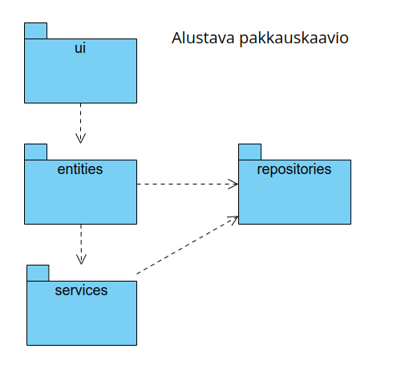
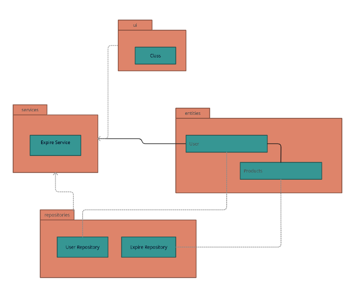
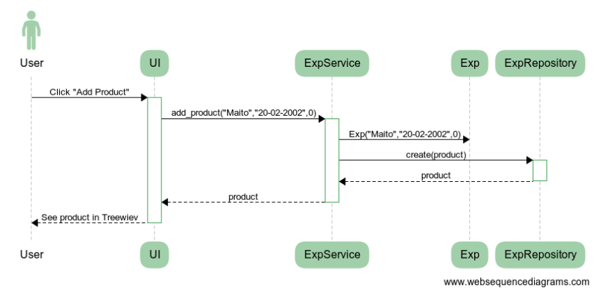

# Arkkitehtuurikuvaus

## Rakenne

Ohjelman rakenne noudattelee kolmitasoista kerrosarkkitehtuuria. Tämä kuva näyttää pakkausrakenteen ja jokaisen pakkauksen sisällöt ovat mainituna tämän alla.

**Vaikkapa kuvassa lukee alustava, päätyi tämä lopulta olemaan oikea, mutta tekstiä ei valitettavasti enään saa pois.**



Kyseiset pakkaukset sisältävät näiden alueiden koodit:

- ui = käyttöliittymä
- services = sovelluslogiikka
- repositories = pysyväistallennus
- entities = sovelluksen käyttämiä objekteja kuvaamaan tuotteita (myöhemmin myös käyttäjiä)

## Käyttöliittymä
- Product-lista
- Muokkaa tuotetta
- Kalenteri
- Valitse käyttäjä
- Luo käyttäjä

 
## Sovelluslogiikka

Sovelluslogiikkaan kuuluu vain yksi luokka, koska käyttäjillä ei ole salasanoja. Siispä tämä Exp:

```mermaid
  classDiagram
    Exp "*" --> "1" User
    class Exp{
        - id
        - product
        - date
        - qty
        - type
```


**Kuvaus**

ExpService saa käyttöliittymältä kommennot, jotka se siirtää ExpRepositoriolle ja UserRepositorille tallennettavaksi/muutettavaksi tiedostoon ja oikeaan kansioon. Tiedot myös muunnetaan Exp luokaksi, jotta ExpRepositorion tallennettavaa listaa on helppo käyttää ja muokata.

## Repositories
- ExpRepository tallentaa tuotteet CSV-tiedostoon.
- UserRepository luo käyttäjien perusteella kansiota, missä CSV-tiedostot sijaitsevat

### Tiedostot

CVS-tiedostoon tallennetut tuotteet ovat seuraavaa formaattia:
```
a93eabc9-5b0a-40d6-8ac8-af2cfb8ee431;Testi;02-05-2023;0 
```
Sisältö vastaa seuraavaa: id ; tuotteen nimi ; vanhentumis päivämäärä ; tila (0 = jääkaappi, 1 = pakaste, 2 = kaappi, 3 = vanhentunut, 4 = käytetty) ; *tulevaisuudessa käyttäjä*

## Kokonaisuus

Tässä vielä luokka/pakkauskaavio, joka kuvastaa ohjelman kokonaisuutta:


## Päätoiminnallisuudet

### Paljon lisää tänne

### Tuotteen lisääminen

Tuotteen tietojen antamisen jälkeen painaen "Add Product" seuraava tapahtuu sovelluksessa sekvenssikaaviolla kuvattuna:


