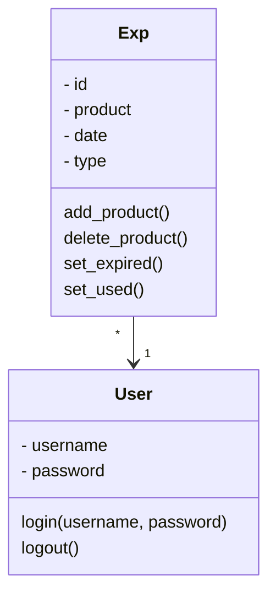

# Arkkitehtuurikuvaus
**Tulen uudistamaan molemmat kuvat lopulliseen työhön!**
## Rakenne

Ohjelman rakenne noudattelee kolmitasoista kerrosarkkitehtuuria. Tämä kuva näyttää pakkausrakenteen ja jokaisen pakkauksen sisällöt ovat mainituna tämän alla.


Kyseiset pakkaukset sisältävät näiden alueiden koodit:

- ui = käyttöliittymä
- services = sovelluslogiikka
- repositories = pysyväistallennus
- entities = sovelluksen käyttämiä objekteja kuvaamaan tuotteita (myöhemmin myös käyttäjiä)

## Käyttöliittymä
**Tämä tulee muuttumaan käyttäjän lisäämisen myötä, joten en kirjoita paljoa**
- Product-lista
- Kalenteri

 
## Sovelluslogiikka

Sovelluslogiikka toimii seuraavasti luokkakaaviossa näytettyjen luokkien User ja Exp kanssa:



Itse toiminnallisuudesta vastaa ExpService, joka käyttää näitä luokkia. Luokkakaaviossa on näytetty joitakin kommentoja, joita molemmilla luokilla on mitä ExpService käyttää.

### Tulen varmaan vaihtamaan luokkakaavion sisältämään myös ExpServicen, koska itse Exp luokallahan ei ole kommentoja. Tämä siis muuttuu!!

## Repositories
**Tämäkin muuttuu...**
ExpRepository tallentaa tuotteet CSV-tiedostoon.

### Tiedostot

CVS-tiedostoon tallennetut tuotteet ovat seuraavaa formaattia:
```
a93eabc9-5b0a-40d6-8ac8-af2cfb8ee431;Testi;02-05-2023;0 
```
Sisältö vastaa seuraavaa: id ; tuotteen nimi ; vanhentumis päivämäärä ; tila (0 = jääkaappi, 1 = pakaste, 2 = kaappi, 3 = vanhentunut, 4 = käytetty) ; *tulevaisuudessa käyttäjä*

## Kokonaisuus

Tässä vielä luokka/pakkauskaavio, joka kuvastaa ohjelman kokonaisuutta:


## Päätoiminnallisuudet

### Paljon lisää tänne

### Tuotteen lisääminen

Tuotteen tietojen antamisen jälkeen painaen "Add Product" seuraava tapahtuu sovelluksessa sekvenssikaaviolla kuvattuna:


