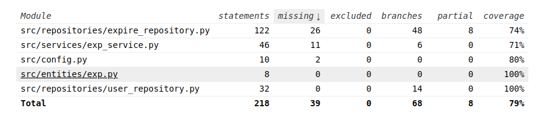

# Testausdokumentti

Ohjelmaa on testattu sekä automatisoiduin yksikkö- ja integraatiotestein unittestilla sekä muuten vain ohjelman tekemisen aikana

## Yksikkö- ja integraatiotestaus

### Sovelluslogiikka

Sovelluslogiikasta vastaavaa ExpService-luokkaa testataan TestExoService-testiluokalla, jossa on käytetty apuna FakeRepository luokkaa, joka kuvaa molempia repositoryja pienellä tasolla.

### Repositorio-luokat

Repositorio-luokkia ExpRepository ja UserRepository testataan "test" kansion kanssa. Kummatkin omilla re

### Testauskattavuus

Testikattavuus on yhtensä 79%. Tästä jääneitä exp_serviceä ja expire_repositorya oli joitakin kohtia, joissa koodia olisi pitänyt muuttaa testejä varten, koska niiden vaikutus on suunniteltu näkyvän vasta käyttöliittymä tasolla

## Järjestelmätestaus

Sovelluksen järjestelmä testausta ei ole tehty Linux fuksilaitteen ulopuolella

## Sovellukseen jääneet laatuongelmat

En loppu kiireissä ehtinyt käydä ohjelmaa mielestäni riittävän hyvin, joten pieniä ongelmia saattaa olla, mitä en ole vain onnistunut löytämään itse.
