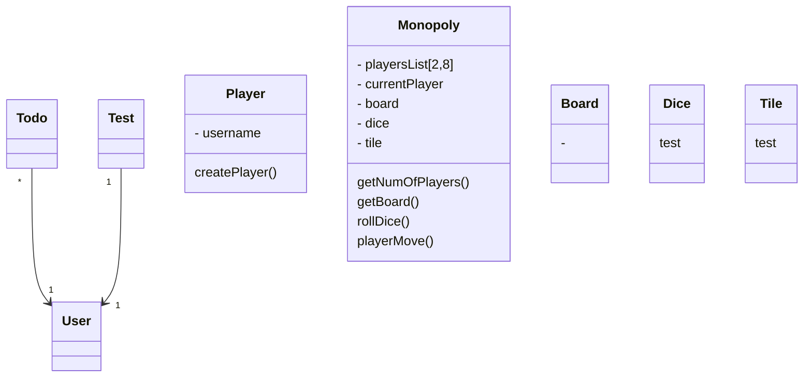

```mermaid
 classDiagram
      Todo "*" --> "1" User
      Test "1" --> "1" User
      class Player{
          - username
          createPlayer()
      }
      class Monopoly{
          - playersList[2,8]
          - currentPlayer
          - board
          - dice
          - tile
          getNumOfPlayers()
          getBoard()
          rollDice()
          playerMove()
      }
      class Board{
          -
      }
      class Dice{
          test
      }
      class Tile{
          test
      }
```
