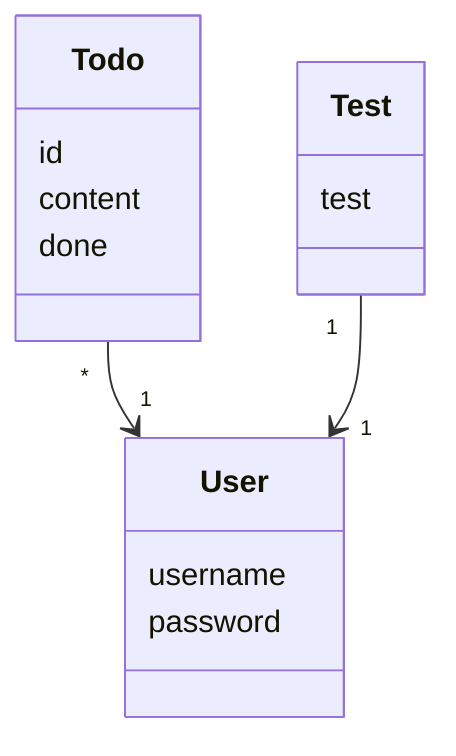

```mermaid
 classDiagram
      Todo "*" --> "1" User
      Test "1" --> "1" User
      class User{
          username
          password
      }
      class Todo{
          id
          content
          done
      }
      class Test{
          test
      }
```
