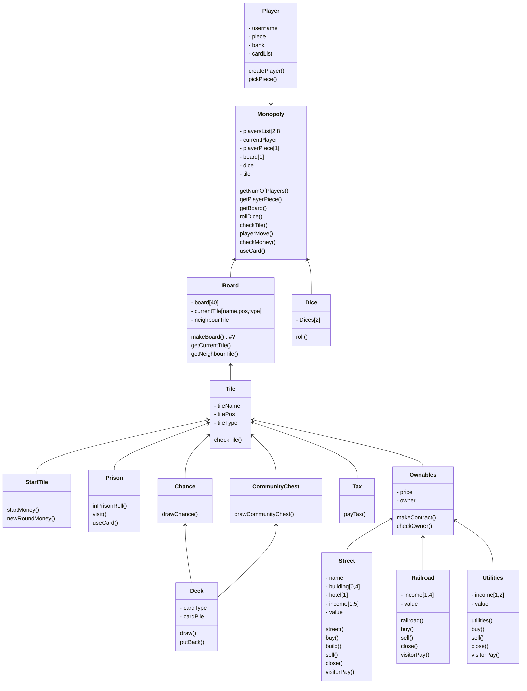

## Osia joista en ole varma onko ne oikein:
- Jätin 1, * jne. käyttämättä, sillä en kunnolla ymmärtänyt niiden merkitystä.. Mutta olettaisin, että vain playerillä on numero
- Enkä ollut 100% mihin suuntaan laittaa nuolet netistä tutkiessani se vaihteli??
- Yleisesti en ole varma onko tässä niin tärkeää ja tarkkaa miten asiat on esitetty. Esim. Alussa pidin mukana int, bool, str kommentojen kohdalla, mutta poistin ne. Pääosin siitä syystä, että en ole edes varma pitikö ns. kommentoja kirjoittaa? Mutta yleisesti tein kaaviosta minulle helpompi ymmärtää, jonka uskon olevan pääasia (+ yleinen muoto)?
- En erikseen laittanut "Pelinappula sijaitsee aina yhdessä ruudussa.", koska ajattelin playerMovin hoitavan tämän?
- En tiennyt pitäisikö tile yhdistää vain boardin kautta vai myös pääluokan nyt on ns. molemmat.
- Tile luokassa jokaiselle checkTileClass vai kaikki samassa? Mielestäni yksi voisi palauttaa kaikki.
- Kaikille Tile luokille erikseen - kohdat? Laitoin vain kommennot.
- Income oletettu, että jokainen tile tietää omansa.

## Monopoly luokkakaavio

