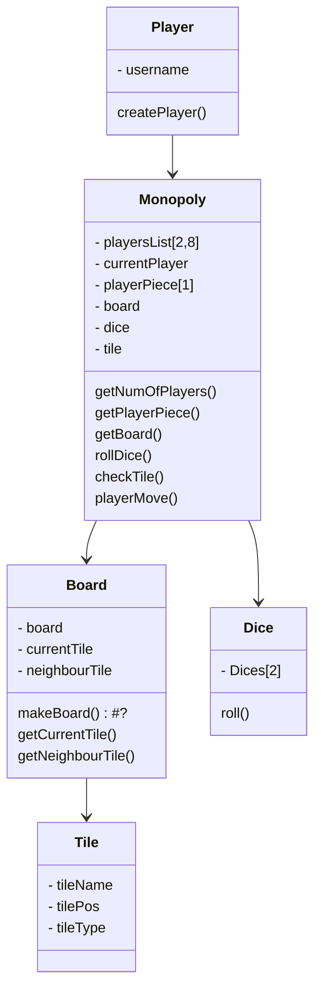

```mermaid
 classDiagram
      Player -->  Monopoly
      Monopoly -->  Board
      Monopoly -->  Dice
      Board -->  Tile
      class Player{
          - username
          createPlayer()
      }
      class Monopoly{
          - playersList[2,8]
          - currentPlayer
          - playerPiece[1]
          - board
          - dice
          - tile
          getNumOfPlayers()
          getPlayerPiece()
          getBoard()
          rollDice()
          checkTile()
          playerMove()
      }
      class Board{
          - board
          - currentTile
          - neighbourTile
          makeBoard() #?
          getCurrentTile()
          getNeighbourTile()
      }
      class Dice{
          - Dices[2]
          roll()
      }
      class Tile{
          - tileName
          - tilePos
          - tileType
          
      }
```
